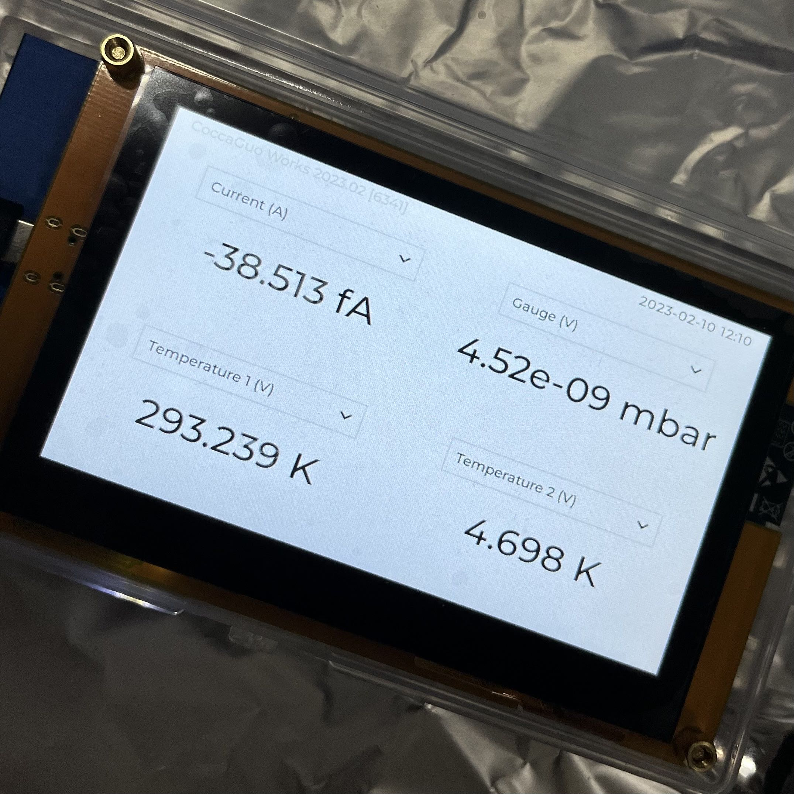

# Quad Information Indicator

This indicator works with a 'Nanonis LabVIEW TCP Interface', which turns the TCP query into a LabVIEW query, and maps the information through the LabVIEW interface, for the reason that the original TCP interface of Nanonis V5 is not stable on our computer.

This Indicator works without a cable line to the computer. It only needs a power supply.

Find more information on the video site bilibili, at [【ESP32】不喜欢远程软件广告的我，做了一个实验室小副屏](https://www.bilibili.com/video/BV1Wj411T7zL) 